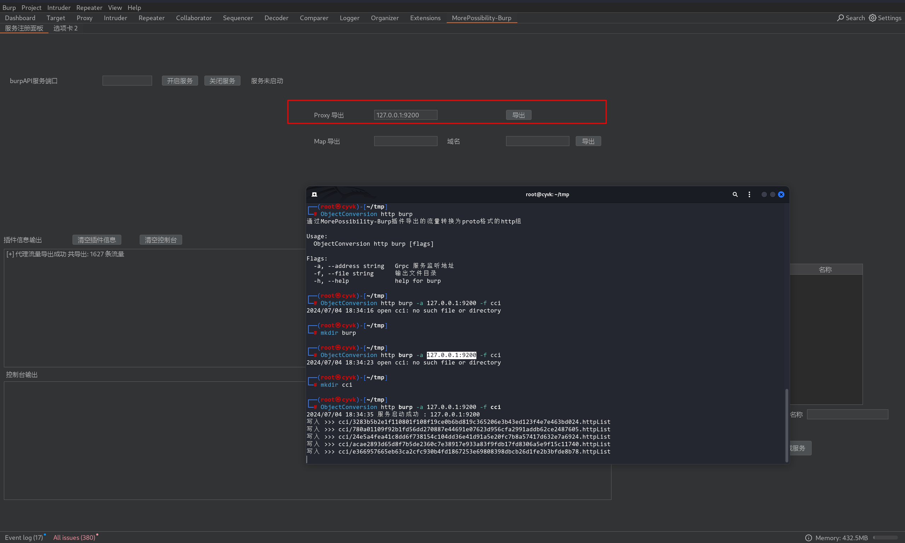
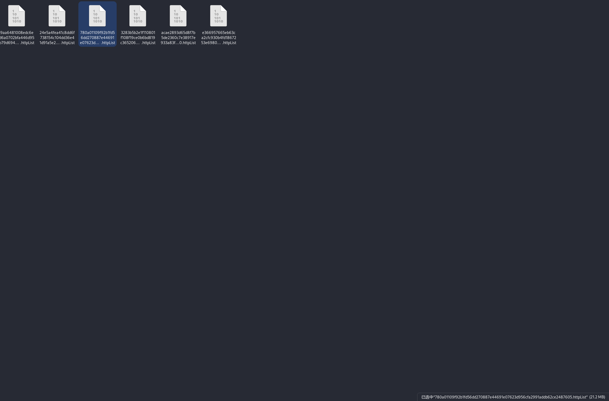
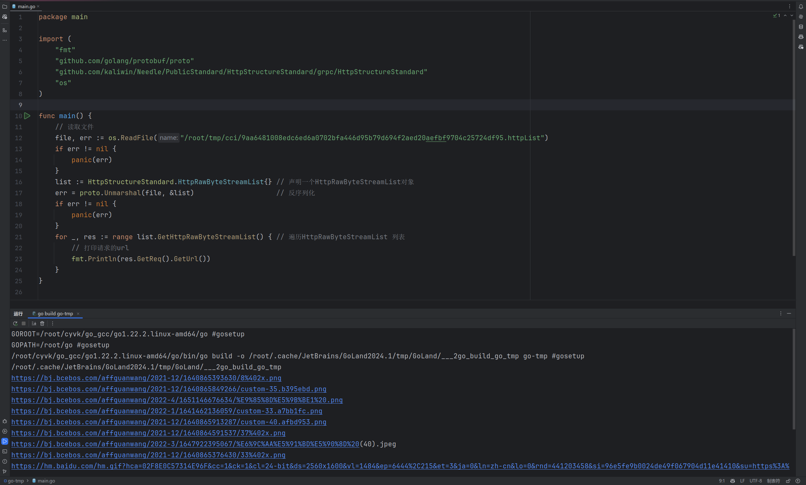
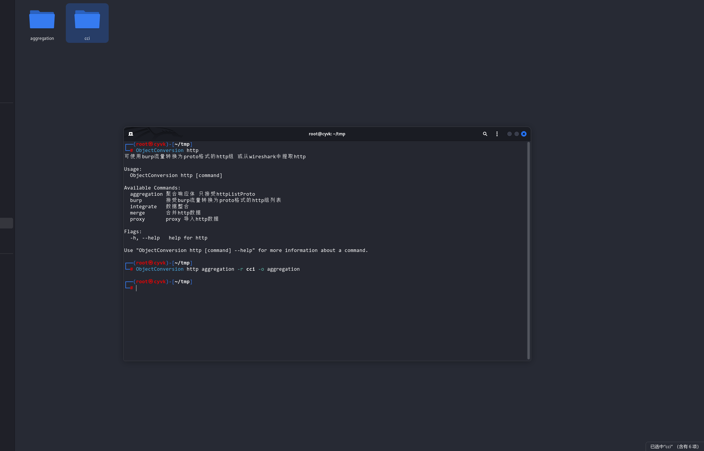
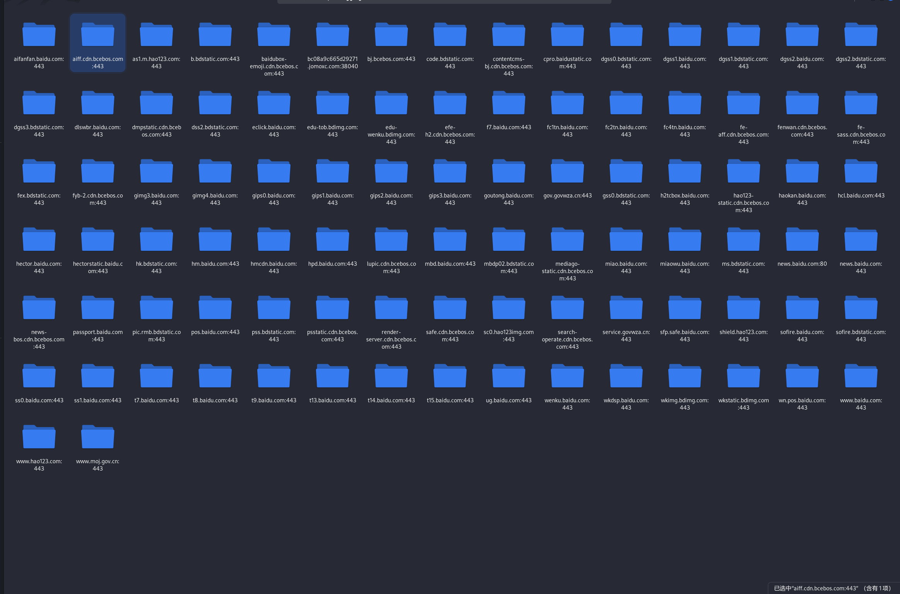
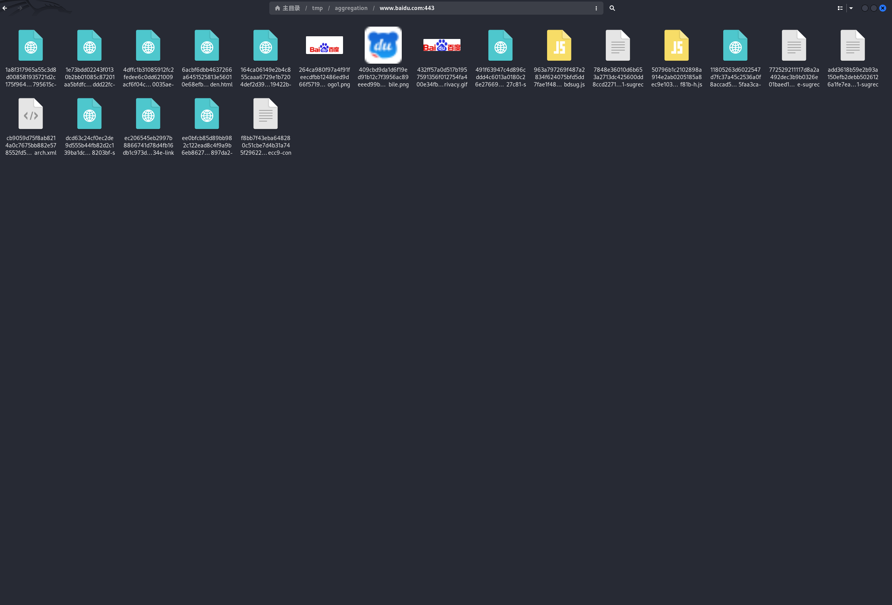
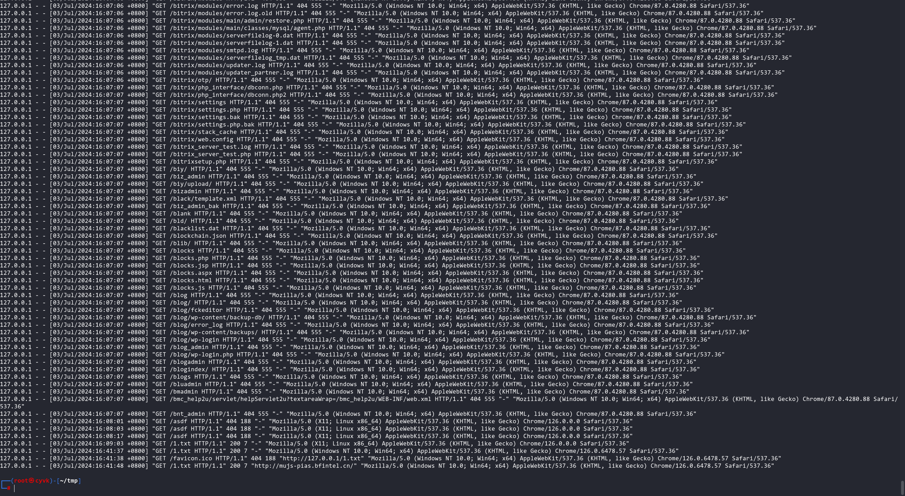

# ObjectConversion


```
ObjectConversion : 对象转换, 通过 Protobuf 设定一种较为广泛通用的数据结构, 其他同类型不同实例的对象只要遵守规定提供 实例到Protobuf的相互转换, 以打通不同对象的互转 
```


## 设计之初


```
在web安全领域中我们对http数据的操作手段太少了, 需要借助不同的程序执行数据分析和测试,但是我们依旧没有办法直接自由的操作http数据, 因此我需要规范http数据报文的标准 来解除束缚。
```


## 应用场景


### 离线数据分析


```
当我们在进行测试时通常会使用很多的burp插件 ,用来实时的对proxy接受到数据进行分析测试, 这是实时的也就是说你在浏览目标功能时扫描分析是同步进行的 , 这会消耗计算资源同步测试也会容易被目标察觉 , 所以我希望他不要和我同步进行而是等到我浏览完了，在启动他 
```


### 为非标准流量构建操作空间


```
逆向场景 , 通常客户端是不能走代理进行抓包分析而是通过逆向手段抓取流量报文, 这些流量报文可以存储在文件中
, 这些文件通常都是单纯的字符串没有办法通过程序进行分析测试

我希望可以将这些流量实例化导入到burp这样就可以GUI分析了 , 又或者转为标准的http流量用公用的分析程序处理他
```


## 程序使用


### 先前条件


需要了解 GRPC 的知识

https://grpc.io/ 


http 结构标准proto文件

https://github.com/kaliwin/Needle/blob/master/PublicStandard/HttpStructureStandard/grpc/HttpStructureStandard.proto


### 离线数据分析


```
ObjectConversion http burp -a 127.0.0.1:9200 -f cci
```


ObjectConversion会开启一个Grpc服务 然后burp发起grpc调用将流量传过来 ObjectConversion接收到以每个文件20M的大小写入磁盘


配合burp插件将流量导出 

burp显示导出后手动Ctrl+C 结束程序




会在目录下写入流量




反序列化文件 就此得到一个对数据的离线操作空间

这是protobuf格式 你可以用python php java 甚至是C 反序列他然后操作他




```go
package main

import (
	"fmt"
	"github.com/golang/protobuf/proto"
	"github.com/kaliwin/Needle/PublicStandard/HttpStructureStandard/grpc/HttpStructureStandard"
	"os"
)

func main() {
	// 读取文件
	file, err := os.ReadFile("/root/tmp/cci/9aa6481008edc6ed6a0702bfa446d95b79d694f2aed20aefbf9704c25724df95.httpList")
	if err != nil {
		panic(err)
	}
	list := HttpStructureStandard.HttpRawByteStreamList{} // 声明一个HttpRawByteStreamList对象
	err = proto.Unmarshal(file, &list)                    // 反序列化
	if err != nil {
		panic(err)
	}
	for _, res := range list.GetHttpRawByteStreamList() { // 遍历HttpRawByteStreamList 列表
		// 打印请求的url
		fmt.Println(res.GetReq().GetUrl())
	}
}

```


#### 数据操作事例


将所有的响应体剥离出来

按照host创建目录然后将所有响应体放进来 文件名有一个sha256的哈希值确保该目录下没有重复的文件 方便分析响应数据


```
ObjectConversion http aggregation -r cci -o aggregation
```











## 为非标准流量构建操作空间


```
以 nginx日志为例 这实际上也是http类型只不过是畸形的因为丢失了很多字段
```





